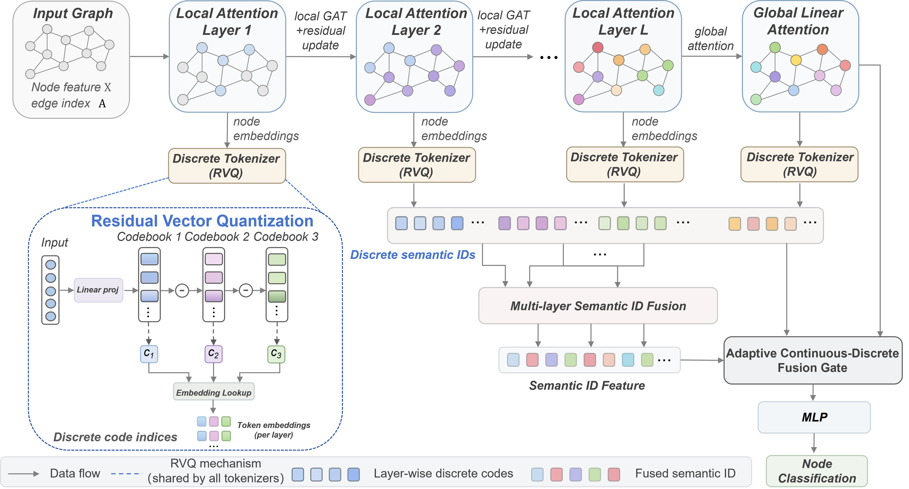

# CoDiFormer: Multi-Stage Semantic Quantization and Adaptive Continuous-Discrete Fusion for Graph Node Classification

<p align="center">

</p>


**Figure 1. The overall architecture of CoDiFormer.**
The framework consists of four main components: (1) local graph representation learning with stacked GAT layers, (2) global dependency modeling with linear attention, (3) hierarchical discrete semantic tokenization based on residual vector quantization (RVQ), and (4) adaptive fusion of continuous and discrete representations for node classification.

## Overview

Graph neural networks (GNNs) usually learn continuous node embeddings for downstream prediction tasks. However, continuous representations may struggle to capture discrete structural patterns and latent semantic clusters in complex graphs.

CoDiFormer introduces a continuous-to-discrete representation learning framework by combining:

- Continuous node representation learning
- Residual Vector Quantization (RVQ)
- Discrete node identity representation
- Knowledge distillation between continuous and discrete branches

The framework improves node classification performance by jointly exploiting continuous semantic information and discrete structural patterns.


## Requirements

The implementation is based on:

- Python >= 3.9
- PyTorch >= 2.0
- PyTorch Geometric >= 2.4

Install dependencies:

```bash
pip install -r requirements.txt
